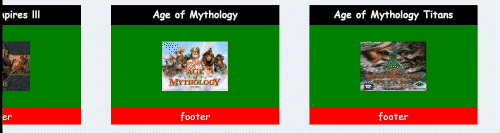
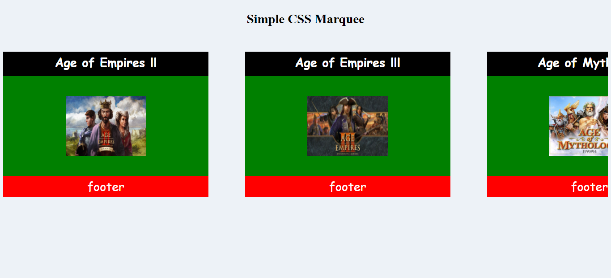

# Simple CSS Marquee
Marquesina hecha con CSS

## ¿Qué es este repo?
Una página web estática con un escaparate en movimiento, puedes darle un vistazo [ haciendo click aquí](https://marfullsen.github.io/Simple-CSS-Marquee/).

## ¿Qué lo diferencia de otros escaparates?
- Este escaparate se devuelve al llegar al final, a diferencia de otros escaparates que comienzan de nuevo.
- No tiene esos saltos irregulares al pasar por los elementos.

## ¿Cómo se hizo el código?
El código está hecho con HTML5 y CSS, no se utilizaron librerías ni frameworks especiales.

## Esto es un fork, ¿Quién es el autor original?
el autor original es [@Ocitotorzido](https://github.com/Ocikotorzido/), el fork fue hecho al repo [Marquee](https://github.com/Ocikotorzido/Marquee)

## Capturas de pantalla

## GitHub Pages
La página está disponible en GitHub Pages.
- [marfullsen.github.io/Simple-CSS-Marquee/](https://marfullsen.github.io/Simple-CSS-Marquee/)

## Recursos.
Repo Marquee [github.com/Ocikotorzido/Marquee](https://github.com/Ocikotorzido/Marquee)

Tag 'Marquee' en Mozilla [developer.mozilla.org/es/docs/Web/HTML/Element/marquee](https://developer.mozilla.org/es/docs/Web/HTML/Element/marquee)